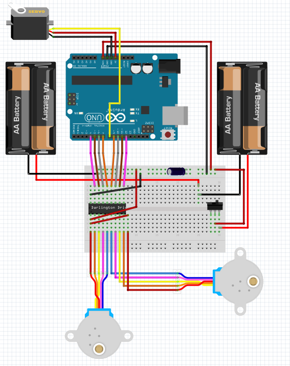

To build our bot we will need the following materials. In some cases we will be able to sustitute some of them but that wil depend on our budget and level of exepertise in order to handle those modifications.

# Electronics

{: style="width: 600px;"}

1. 1x Arduino UNO and its USB cable
1. 2x Geared 5V Stepper - adafruit.com/products/858
1. 1x ULN2803 Darlington Driver
1. 1x Half-size breadboard
1. 12x Male-male jumpers
1. 1x Micro servo - adafruit.com/products/169
1. 1x Male pin header - digikey.com/short/t93cbd
1. 1x 2 x AA Holder - digikey.com/short/tz5bd1
1. 1x-3 x AA Holder - digikey.com/short/t5nw1c
1. 1x-470 uF 25V capacitor
1. 1x SPDT slide switch (but I recommend a bigger switch)
1. 5x AA Batteries

# Mechanics
1. 2x 1 7/8” ID x 1/8” O-ring - mcmaster.com/#9452K96
1. 1x Caster 5/8” bearing - mcmaster.com/#96455k58/=yskbki
1. 10x M3 x 8mm pan head screw - mcmaster.com/#92005a118/=z80pbr
1. 4x M3 x 6mm flat head screw - mcmaster.com/#91420a116/=yskru0
1. 12x M3 Nut - mcmaster.com/#90591a250/=yskc6u3D
1. 2x 1/4” thread forming 4 -20 screws http://www.mcmaster.com/#90380A106
1. 3D printed parts made of PLA+

# 3D printed parts

{: style="width: 400px;"}

1. [front-pale](https://github.com/MarceJara/FutureBot-MiniSumoBot/blob/gh-pages/assets/3d_models/front_pale.stl)
1. [front-ramp](https://github.com/MarceJara/FutureBot-MiniSumoBot/blob/gh-pages/assets/3d_models/front_ramp.stl)
1. [sumo-back-ceiling](https://github.com/MarceJara/FutureBot-MiniSumoBot/blob/gh-pages/assets/3d_models/sumo_back_ceiling.stl)
1. [sumo-base](https://github.com/MarceJara/FutureBot-MiniSumoBot/blob/gh-pages/assets/3d_models/sumo_base.stl)
1. [sumo-front-ceiling](https://github.com/MarceJara/FutureBot-MiniSumoBot/blob/gh-pages/assets/3d_models/sumo_front_ceiling.stl)
1. [sumo-side-left](https://github.com/MarceJara/FutureBot-MiniSumoBot/blob/gh-pages/assets/3d_models/sumo_side_left.stl)
1. [sumo-side-right](https://github.com/MarceJara/FutureBot-MiniSumoBot/blob/gh-pages/assets/3d_models/sumo_side_right.stl)
1. [ultrasonic-support](https://github.com/MarceJara/FutureBot-MiniSumoBot/blob/gh-pages/assets/3d_models/ultrasonic_support.stl)

