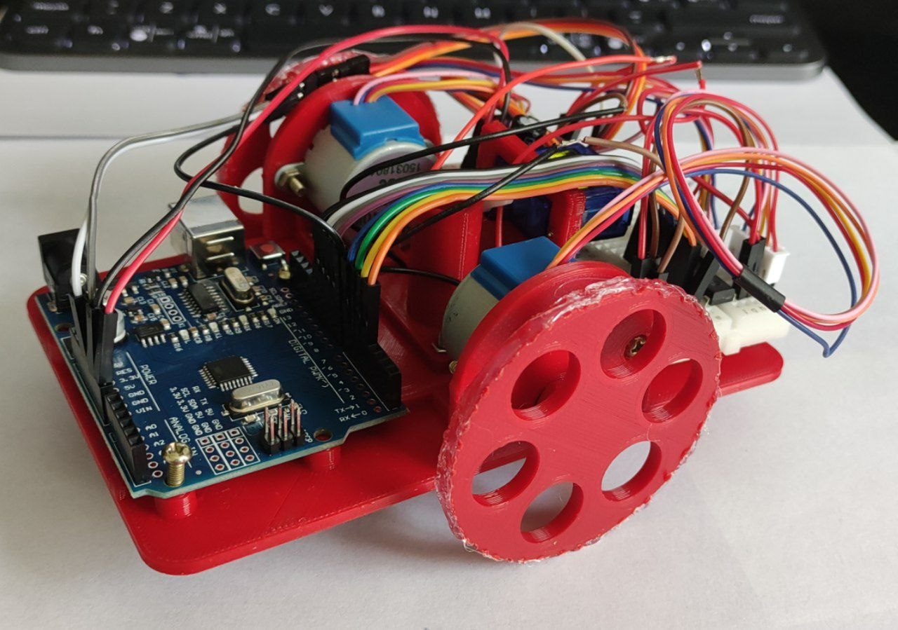

VinciBot is a painter robot made for teaching STEM and making it draw and maybe write. If you do this project, you will learn about robotics, programming, Arduino, electronics, and more. Also, you will be able to customize whatever you want.

# References
- [MIT-media-lab-doodle-bot](https://mitmedialab.github.io/doodlebot/make.html) 
- [3D-parts](https://github.com/mitmedialab/doodlebot/blob/master/parts)

# To-Dos

| Task | State |
|-------|--------|
| Check out the motor masks | Not implemented |
| Implement the AI Part | Not implemented |
| Find a workaround for the gripo f the wheels | Not implemented |